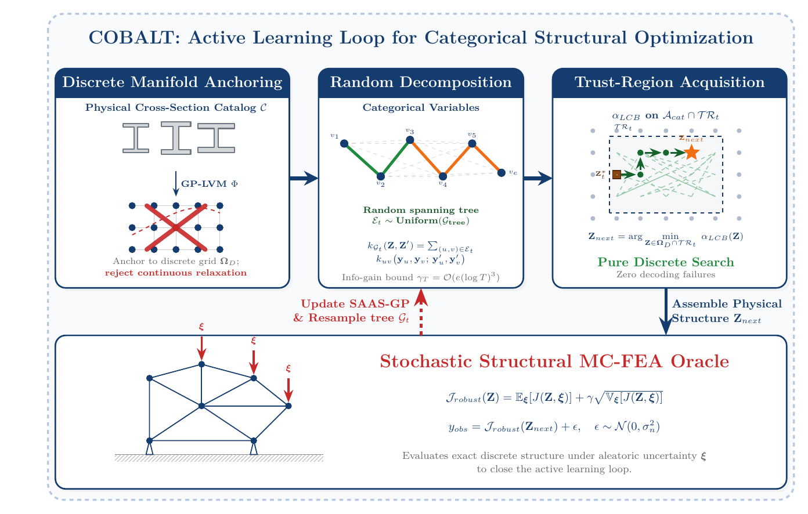
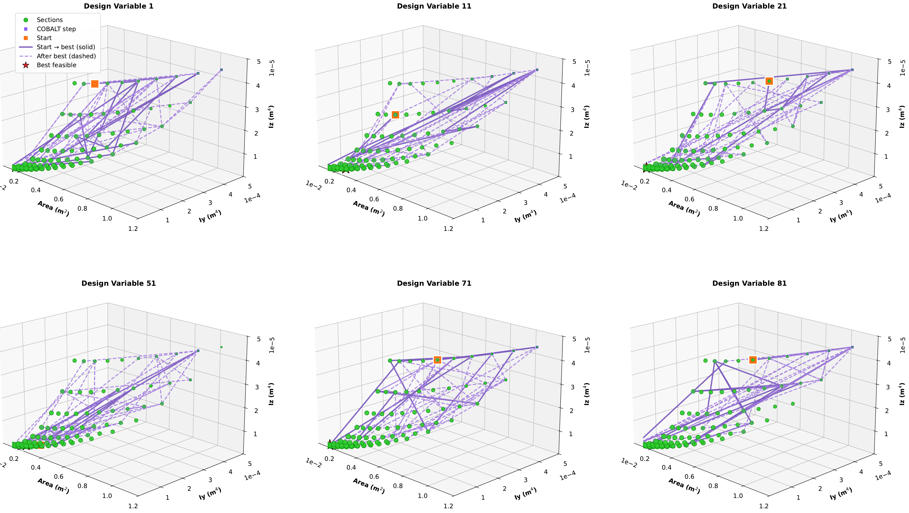
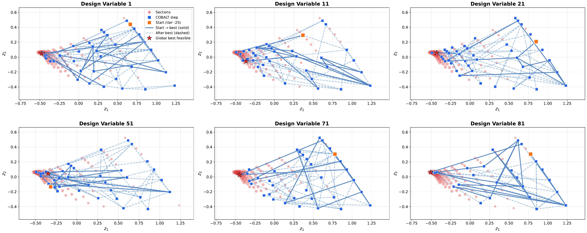

# COBALT Source Code

This package contains the paper-aligned COBALT implementation and the 10-beam
and 105-beam benchmark definitions used in the revised submission.

## Method

COBALT maps the normalized physical section catalogue to fixed Isomap anchors.
It never optimizes a continuous latent point and therefore never rounds a
proposal back to the catalogue. At every sequential iteration it uniformly
samples a spanning tree over the categorical variables, fits a fully Bayesian
additive SAAS-GP with one ARD Matern-5/2 component per tree edge, and
marginalizes the hierarchical Half-Cauchy inverse-lengthscale prior with NUTS.
The edge-factorized LCB is minimized only over anchored graph candidates inside
an adaptive L-infinity trust region. Dijkstra paths define crossover and
mutation moves.

Every selected catalogue design is evaluated by MC-FEA. The objective and
constraints use the sample mean plus one sample standard deviation. The
finite-sample variance of the robust objective estimator is estimated by a
seeded bootstrap and passed to the GP as design-dependent observation noise.
No failed MC-FEA realization is discarded.

[Vector PDF: COBALT framework](assets/figures/cobalt-framework.pdf)

## Results

The following figures visualize a six-variable projection of a 105-beam run.
They show catalogue-valid search trajectories; they are not aggregate
performance statistics.

[Vector PDF: physical trajectory](assets/figures/105bar-physical-trajectory.pdf)

[Vector PDF: latent trajectory](assets/figures/105bar-latent-trajectory.pdf)

## Layout

- `10beam/core/`: 10-member FEA, 54-section catalogue, COBALT engine, runner,
  invariant tests, and dependencies.
- `105beam/core/`: 105-member FEA and the same COBALT engine and result format.
- `assets/figures/`: documentation figures in PNG and vector PDF formats.
- `result_schema.json`: machine-readable run-record schema.

The two benchmark directories are independently executable. The duplicated
`cobalt_engine.py` and `run_cobalt.py` files are intentionally identical so
that either benchmark can be released or reproduced on its own.

## Reproduction

Install `core/requirements.txt`, run `python test_cobalt_engine.py`, and then
use the command in the benchmark README. Complete JSON records include the
configuration, topology, environment, Isomap diagnostics, every MC-FEA
observation, every sampled tree, NUTS summaries, timing, resource use, and a
disjoint independent validation of the selected feasible recommendation.
